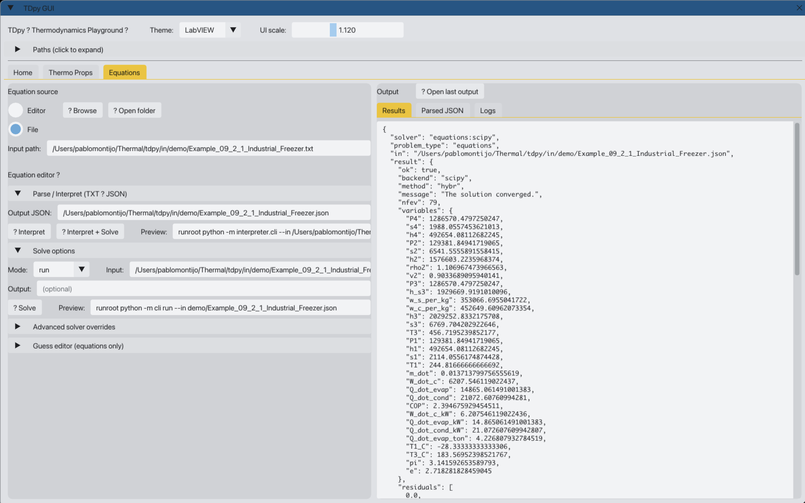
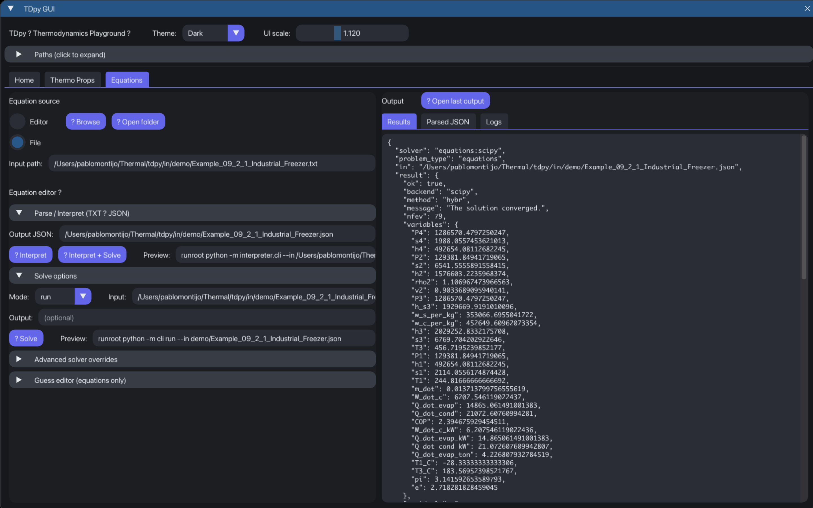
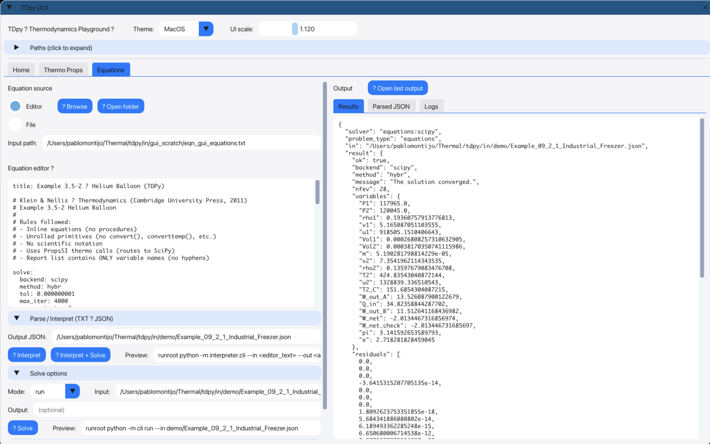

# TDPy

**Python-first thermodynamics, property evaluation, nonlinear equation solving, optimization, and thermal-analysis workflows inspired by EES.**

TDPy is a Python-first engineering toolkit for thermodynamics, property evaluation, nonlinear equation solving, optimization, and 1D thermal analysis. It is inspired by the EES workflow, but built as an open, scriptable, extensible platform around JSON/TXT inputs, CLI tools, and GUI workflows.

In plain terms: **TDPy is an open engineering workbench for solving thermodynamics and equation-based engineering problems in Python.**

---

# TDPy

[](https://pablomarcel.github.io/tdpy/)
[](https://github.com/pablomarcel/tdpy/actions/workflows/pages.yml)
[](https://www.python.org/)
[](LICENSE)

**Python-first thermodynamics, property evaluation, nonlinear equation solving, optimization, and thermal-analysis workflows inspired by EES.**

TDPy is a Python-first engineering toolkit for thermodynamics, property evaluation, nonlinear equation solving, optimization, and 1D thermal analysis. It is inspired by the EES workflow, but built as an open, scriptable, extensible platform around JSON/TXT inputs, CLI tools, and GUI workflows.

In plain terms: **TDPy is an open engineering workbench for solving thermodynamics and equation-based engineering problems in Python.**

---

## Documentation

The live documentation is published with Sphinx and GitHub Pages:

**https://pablomarcel.github.io/TDPy/**

The documentation site includes API references for the main TDPy application layer, equation-solving modules, interpreter pipeline, thermodynamic-property backends, GUI helpers, and supporting utilities.

Useful documentation links:

- [TDPy documentation portal](https://pablomarcel.github.io/TDPy/)
- [API Reference](https://pablomarcel.github.io/TDPy/api.html)
- [GitHub Pages deployment workflow](.github/workflows/pages.yml)

For local documentation builds:

```bash
python -m cli sphinx-skel docs
make -C docs html
```

## Screenshots

### GUI workflow — light theme



The light-theme workflow shows the main TDPy desktop interface with file selection on the left and solver results on the right. This layout is useful when running saved engineering examples from the project input library and quickly inspecting the computed outputs.

### GUI workflow — dark theme



The dark-theme workflow shows the same industrial-freezer style case with a darker interface. The goal is to make repeated engineering runs more comfortable while keeping the solver workflow clear: select an input, run the problem, and inspect the results.

### Equation-editor workflow



TDPy also supports a manual equation-editor workflow. Instead of selecting a saved input file, users can type or paste equations directly into the editor pane, run the solver, and view the computed result in the output panel. This is closer to the interactive feel of an EES-style equation-solving session.

---

## Why TDPy

Engineering tools like EES are powerful because they combine property calls, equation-based solving, and practical engineering workflows in one place. TDPy brings that style of workflow into Python so it can be:

- open and inspectable
- scriptable from the CLI
- extensible with new solvers and backends
- easier to integrate with modern Python tooling
- usable through both text-based and GUI workflows

The project is meant for engineers who want the convenience of equation-oriented thermodynamics workflows without being locked into a closed desktop environment.

---

## What it does

TDPy currently focuses on these capabilities:

### Thermodynamic property evaluation

- property/state evaluation workflows
- support for multiple backend styles, including CoolProp-oriented workflows and native mixture backends
- engineering-friendly input/output structures
- reusable property-call patterns for thermodynamics examples

### Nonlinear equation solving

- EES-style equation-system workflows
- generic nonlinear system solving
- JSON/TXT driven inputs
- optional interpreter flow from text to structured problem specs
- report-variable support for clean engineering outputs

### Optimization

- optimization workflows built on the same equation-oriented architecture
- design variables, objective functions, and constraints
- solver routing through a common application layer
- room to expand into design studies and parameter searches

### 1D thermal / engineering analysis

- support for engineering problem pipelines beyond pure equation solving
- extensible architecture for additional domain solvers
- practical thermal-analysis workflows that can grow alongside the property and equation solvers

### CLI + GUI

- command-line workflows for reproducible runs
- Dear PyGui frontend for interactive usage
- shared application service underneath both interfaces
- file-picker and direct equation-editor modes

---

## Project philosophy

TDPy is built around a few core ideas:

- **Python first**: use normal Python project structure, code, and tooling
- **EES-inspired workflow**: property calls, equations, and engineering analysis in one environment
- **Open architecture**: modular packages instead of a monolithic black box
- **File-driven reproducibility**: JSON, YAML, and TXT inputs that can be version-controlled
- **Extensibility**: easy to add new problem types, solvers, and property backends
- **GUI and CLI parity**: the desktop interface and command-line tools should sit on top of the same backend logic

---

## Repository structure

The codebase is organized into focused packages and top-level orchestration scripts.

```text
thermo_props/        # thermodynamic property evaluation backends and facade
equations/           # equation specs, safe evaluation, solver routing, optimization support
interpreter/         # text-to-spec interpretation pipeline
units/               # lightweight unit parsing and conversion
docs/images/         # README screenshots and documentation images
in/                  # example/problem inputs
out/                 # generated outputs

gui_core_dpg.py      # Dear PyGui frontend
app.py               # central application service
cli.py               # command-line entry point
design.py            # problem/spec builder layer
main.py              # interactive text/menu entry point
```

---

## Typical workflows

### 1) Run a problem from the CLI

```bash
python -m cli run --in your_problem.json
```

### 2) List available inputs

```bash
python -m cli list-inputs
```

### 3) Launch the GUI

```bash
python -m gui_core_dpg
```

### 4) Use the interactive menu

```bash
python -m main
```

---

## GUI workflows

TDPy has two useful desktop interaction patterns.

### File-driven workflow

Use the left pane to select a saved problem input, run it, and inspect the solver result in the right pane. This is ideal for repeatable engineering examples, textbook-style problems, and version-controlled studies.

### Equation-editor workflow

Use the editor pane to manually enter equations and solver setup information. This is useful for quick experiments, one-off engineering calculations, and EES-style equation-solving sessions where the problem is easier to type directly than to package as a full JSON file.

---

## Input style

TDPy is designed around engineering-friendly input files:

- **JSON** for structured, reproducible problem definitions
- **YAML** for readable configs where supported
- **TXT** for lightweight equation/property workflows and interpreter-based flows

This makes it suitable for:

- quick experimentation
- structured engineering studies
- future GUI integration
- version-controlled analysis workflows

---

## Input example

```text
title: Example 1.6-2 Power required by a vehicle (Prius vs Escape) — TDPy

# Klein & Nellis — Thermodynamics (Cambridge University Press, 2011)
# Example 1.6-2  Power required by a vehicle
#
# Rules followed:
# - Inline equations (no procedures)
# - Unrolled primitives (no convert(), converttemp(), etc.)
# - No scientific notation
# - Report variables listed without hyphen bullets

solve:
  backend: scipy
  method: hybr
  tol: 0.000000001
  max_iter: 2000
  max_restarts: 2

given:
  # ---------------- base inputs (as given in the book) ----------------
  rho_lbm_ft3 = 0.075
  vel_mph = 65.0
  f = 0.02

  C_d_prius = 0.29
  A_f_prius_ft2 = 21.2
  W_prius_lbf = 2930.0

  C_d_escape = 0.40
  A_f_escape_ft2 = 29.0
  W_escape_lbf = 3272.0

  # ---------------- unrolled conversion factors ----------------
  lbm_to_kg = 0.45359237
  ft_to_m = 0.3048
  ft2_to_m2 = 0.09290304
  mph_to_mps = 0.44704
  lbf_to_N = 4.4482216152605

  W_to_kW = 0.001
  hp_per_W = 0.0013410220895950279

  # ---------------- converted / derived quantities ----------------
  lbm_ft3_to_kg_m3 = lbm_to_kg / (ft_to_m * ft_to_m * ft_to_m)
  rho = rho_lbm_ft3 * lbm_ft3_to_kg_m3
  vel = vel_mph * mph_to_mps

  A_f_prius = A_f_prius_ft2 * ft2_to_m2
  A_f_escape = A_f_escape_ft2 * ft2_to_m2

  W_prius = W_prius_lbf * lbf_to_N
  W_escape = W_escape_lbf * lbf_to_N

guesses:
  ? F_r_prius = 260.7
  ? F_d_prius = 289.7
  ? W_dot_prius = 16000.0
  ? W_dot_prius_kW = 16.0
  ? W_dot_prius_hp = 21.5

  ? F_r_escape = 291.1
  ? F_d_escape = 546.6
  ? W_dot_escape = 24300.0
  ? W_dot_escape_kW = 24.3
  ? W_dot_escape_hp = 32.6

equations:
  # ---------------- Prius ----------------
  F_r_prius - (f * W_prius) = 0.0
  F_d_prius - (A_f_prius * C_d_prius * rho * vel * vel / 2.0) = 0.0
  W_dot_prius - ((F_r_prius + F_d_prius) * vel) = 0.0
  W_dot_prius_kW - (W_dot_prius * W_to_kW) = 0.0
  W_dot_prius_hp - (W_dot_prius * hp_per_W) = 0.0

  # ---------------- Escape ----------------
  F_r_escape - (f * W_escape) = 0.0
  F_d_escape - (A_f_escape * C_d_escape * rho * vel * vel / 2.0) = 0.0
  W_dot_escape - ((F_r_escape + F_d_escape) * vel) = 0.0
  W_dot_escape_kW - (W_dot_escape * W_to_kW) = 0.0
  W_dot_escape_hp - (W_dot_escape * hp_per_W) = 0.0

report:
  rho_lbm_ft3, vel_mph, f
  rho, vel
  C_d_prius, A_f_prius_ft2, A_f_prius, W_prius_lbf, W_prius
  F_r_prius, F_d_prius, W_dot_prius, W_dot_prius_kW, W_dot_prius_hp
  C_d_escape, A_f_escape_ft2, A_f_escape, W_escape_lbf, W_escape
  F_r_escape, F_d_escape, W_dot_escape, W_dot_escape_kW, W_dot_escape_hp
```

---

## Current direction

TDPy is evolving toward an open engineering environment that combines:

- thermodynamic properties
- nonlinear solving
- optimization
- engineering simulation workflows
- GUI and CLI frontends on top of the same backend services

The long-term direction is a Python-native alternative to closed thermodynamics and equation-solving workflows.

---

## Status

**Current release stage:** early alpha / usable engineering prototype.

The architecture is already modular, and the project can run meaningful engineering examples, but the codebase is still growing in scope, features, and polish.

Expect:

- active refactoring
- new problem types
- backend expansion
- GUI improvements
- more example inputs and workflows
- stronger packaging and release polish over time

---

## Who it is for

TDPy is a good fit for:

- mechanical engineers
- thermal/fluids engineers
- engineering students
- researchers
- Python developers building engineering tools
- anyone who likes the EES workflow but wants something more open, scriptable, and Python-native

---

## Suggested GitHub topics

```text
python
thermodynamics
equation-solver
nonlinear-solver
scientific-computing
engineering
thermal-engineering
simulation
property-calculations
optimization
coolprop
dearpygui
```

---

## Roadmap

Natural next-step upgrades include:

- richer thermodynamic property examples
- broader backend support
- stronger equation interpreter behavior
- more robust units handling
- improved GUI session management
- polished input/output panels
- better error reporting for failed solves
- more complete example libraries from thermodynamics textbooks
- packaging into a friendlier installable engineering application

---

## Long-term vision

TDPy aims to become a Python-native engineering platform that can serve as an open, extensible alternative to closed thermodynamics and equation-solving workflows.

The goal is not just to solve isolated equations. The goal is to create a practical environment where property calls, nonlinear systems, optimization, thermal analysis, GUI workflows, and command-line automation can live together in one inspectable Python codebase.

---

## License

See [`LICENSE`](LICENSE).

---

If you are interested in thermodynamics, engineering computation, equation-based modeling, or EES-style workflows in Python, **TDPy is the project.**
